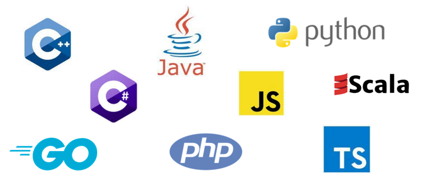

# Target languages

<figure><figcaption><p>Telosys 4.0 predefined target languages</p></figcaption></figure>

With Telosys you can generate any type of language by managing yourself all the target language specificities. But for the most common languages you can indicate the nature of your target language so as to simplify the writing of templates.

The target language can be specified in the template files (.vm) using the following directive :

```
#set( $env.language = 'LanguageName' )
```

Thus Telosys will be able to apply certain default behaviors, for example to convert the 'neutral type' of the model into a language-specific type or to determine literal values adapted to the language.

By default the target language is Java.

In the templates the target language has an influence on :

* $attribute.**type**&#x20;
* $attribute.**fullType**&#x20;
* $attribute.**simpleType**&#x20;
* $attribute.**wrapperType**
* $attribute.**isPrimitiveType()**


All the pre-configured target languages currently supported by Telosys are defined below :

* [C++](cplusplus.md)
* [C#](csharp.md)
* [Golang](golang.md)
* [Java](java.md)
* [JavaScript](javascript.md)
* [Kotlin](kotlin.md)
* [PHP](php.md)
* [Python](python.md)
* [Scala](scala.md)
* [TypeScript](typescript.md)

For more detailed information, see the automatically generated documentation :&#x20;

* **Latest version (4.1)**&#x20;
  * [Target languages in Telosys latest version](https://www.telosys.org/doc/latest/languages/)
* Previous version :&#x20;
  * [Target languages in Telosys version 4.0](https://www.telosys.org/doc/v400/languages/index.html)
  * [Target languages in Telosys version 3.3](https://www.telosys.org/doc/v330/languages/index.html)
