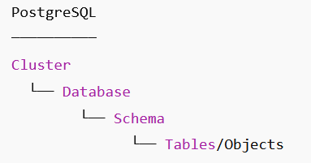

# Telosys terminal in VSCode


Visual Studio Code includes a full featured integrated terminal that starts at the root of your workspace ( see [https://code.visualstudio.com/docs/terminal/basics](https://code.visualstudio.com/docs/terminal/basics) ).

This terminal is the ideal place to launch and use Telosys-CLI. So you can run all Telosys-CLI commands while staying in VSCode.


## Standard terminal usage&#x20;

The most basic way to use Telosys in VSCode is to launch a standard terminal (predefined in VSCode) to get a shell and to launch Telosys from the command line.

<figure><figcaption></figcaption></figure>

But you will have to launch Telosys manually and to set the home directory each time you want to use it.

What's more, the terminal's name is "java", which is not self-explanatory.

To benefit from a dedicated Telosys terminal, simply create a "terminal profile", as described below...

## Specific terminal profile

VSCode allows to define specific terminal profiles ( see [https://code.visualstudio.com/docs/terminal/profiles](https://code.visualstudio.com/docs/terminal/profiles) )&#x20;

Here's how to define a terminal profile for Telosys by editing the "settings.json" file.

### Open the "settings.json" file

Launch the "command palette" with  \[ Ctrl ]  +  \[ Shift ]  +  \[ P ]

Search "open settings json"&#x20;

<div align="left">

<figure><figcaption></figcaption></figure>

</div>

Choose the JSON file to edit:\
"**User Settings**" JSON file (recommanded to be able to use the terminal in any workspace)\
or\
"**Workspace Settings**" JSON file (to store the file in the current workspace)

### Edit the "settings.json" file

In section "**terminal.integrated.profiles.windows**" add an entry for "**Telosys**" with&#x20;

* "**path**"  ->  the command to launch = Java executable file&#x20;
* "**args**"  ->  the command arguments:
  * "-jar" +  "full path to telosys-cli-X.X.X-nnn.jar"  \
    this is the ".jar" file to be executed by Java  = telosys jar file\
    do not forget to change it when you upgrade Telosys to a new version&#x20;
  * "-h" + "." \
    to define the current directory as the Telosys "home"\
    ( for a VSCode terminal the current directory is the root of your workspace )
* "**overrideName**" = "**true**"  ->  to replace the dynamic terminal title&#x20;
* "_**icon**_"  ->  optional (just to set a specific terminal icon )
* "_**color**_"  ->  optional ( just to set the icon color )

Example:

```json

    "terminal.integrated.profiles.windows": {

        "PowerShell": {
            "source": "PowerShell",
            "icon": "terminal-powershell"
        },
        "Command Prompt": {
            "path": [
                "${env:windir}\\Sysnative\\cmd.exe",
                "${env:windir}\\System32\\cmd.exe"
            ],
            "args": [],
            "icon": "terminal-cmd"
        },
        "Git Bash": {
            "source": "Git Bash"
        },

        "Telosys": {
            "overrideName": true,
            "path": [
                "C:\\PATH\\TO\\JAVA\\bin\\java.exe"
            ],
            "args": ["-jar", "C:\\PATH\\TO\\TELOSYS\\telosys-cli-4.0.0-001.jar", "-h", "."],
            "icon": "terminal",
            "color": "terminal.ansiGreen"
        }
   },


```


After this configuration "Telosys" appears as a new kind of terminal in VSCode&#x20;

<div align="left">

<figure><figcaption></figcaption></figure>

</div>

so you just have to launch it and it is ready to use in the current workspace

<div align="left">

<figure><figcaption></figcaption></figure>

</div>
