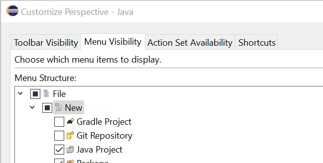
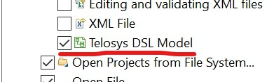

# Eclipse customization

Once Telosys plugin is installed you can customize few Eclipse features in order to be more comfortable.

## Telosys menu visibility

You can customize your Eclipse perspective so that Telosys actions are accessible from the first menu level \(instead of going through "Other / Telosys "\)

In the main Eclipse menu : 

**Window / Perspective / Customize Perspective...** 

In "**Menu visibility**" tab :  **File / New**

Select the Telosys menu entry :

Click **"Apply and Close**"

