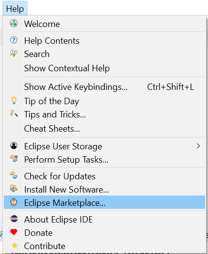
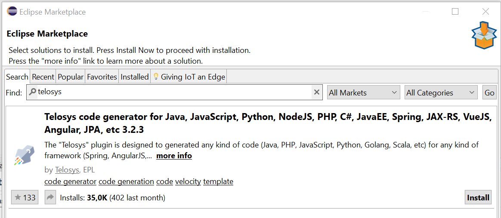

# Eclipse plugin installation

Telosys plugin can be installed as any other Eclipse plugin by using **Eclipse Marketplace wizard**.

### **1 -** Open Eclipse Marketplace wizard

In the **Eclipse main menu**, select **"Help"** and **"Eclipse Marketplace..."**

If Eclipse cannot connect the Eclipse Market Place web site check the proxy configuration \( in Window - Preferences - General - Network Connection \)

### 2 - Search Telosys plugin in Eclipse Marketplace

In the **"Find"** field enter **"Telosys"** and press Return or click **"Go"**

When the Telosys plugin is found, click on "**Install**"

### 3 - Install Telosys plugin

Select **all the features** and press **"Next &gt;"**

Select "I accept the terms of the license agreement" and press **"Finish"**

Ignore the security warning about the certificate and press **"Ok"**

Just restart Eclipse and check the installation

### 4 - Check the installation

Once the Telosys plugin is installed you can see its logo in the "About" window :

In the menu select "Help" - "About Eclipse"

It is also present in the "Installation Details" \( in the "Features" and "Plugins" tabs \)

