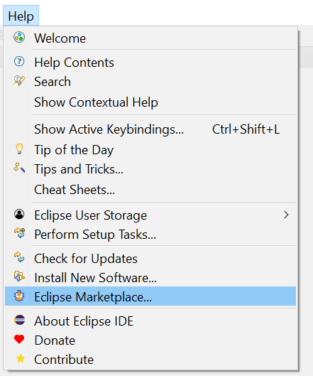
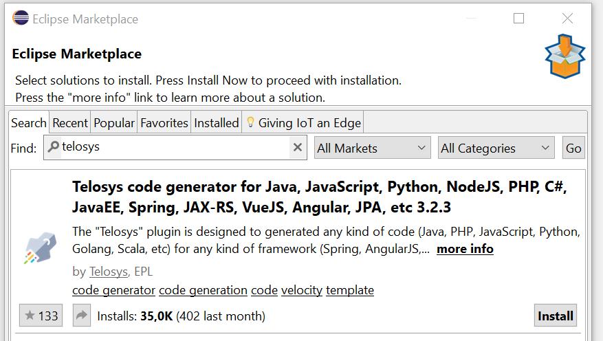
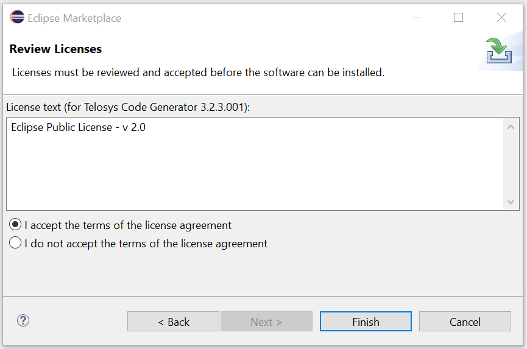
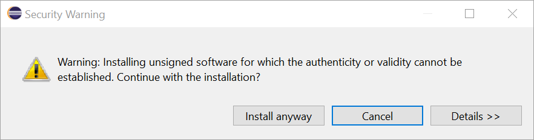
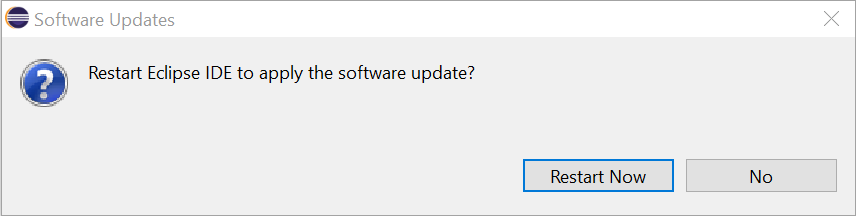
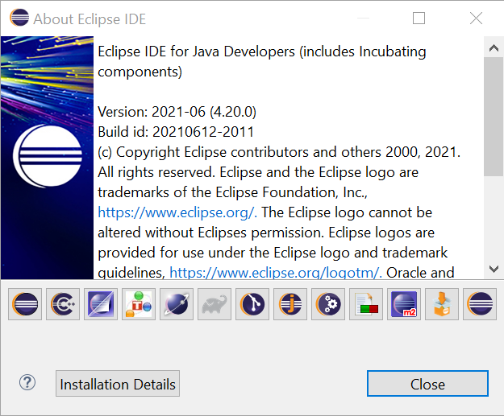
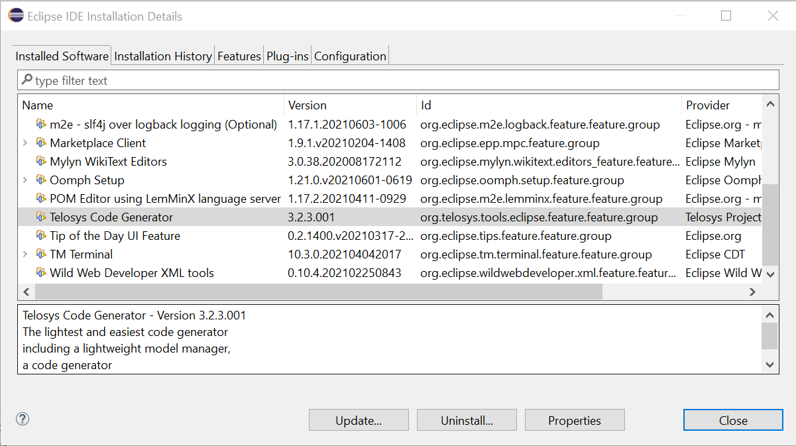

# Eclipse plugin installation

Telosys plugin can be installed as any other Eclipse plugin by using **Eclipse Marketplace wizard**.

### **1 -** Open Eclipse Marketplace wizard

In the **Eclipse main menu**, select **"Help"** and **"Eclipse Marketplace..."**

If Eclipse cannot connect the Eclipse Market Place web site check the proxy configuration \( in Window - Preferences - General - Network Connection \)

### 2 - Search Telosys plugin in Eclipse Marketplace

In the **"Find"** field enter **"Telosys"** and press Return or click **"Go"**

When the Telosys plugin is found, click on "**Install**"

### 3 - Install Telosys plugin

To install an Eclipse plugin you must accept the terms of its license

Select "_I accept the terms of the license agreement_ " and press **"Finish".**

A security warning message is displayed due to the absence of certificate in the plugin.

Ignore the security warning and press **"Install anyway"**.

After installation Eclipse needs to restart

Just restart Eclipse and check the installation.

### 4 - Check the installation

In the menu select "**Help**" - "**About Eclipse**"

Click on "**Installation Details**" 

"Telosys Code Generator" must be present in the list of installed software. You can also check its version.

