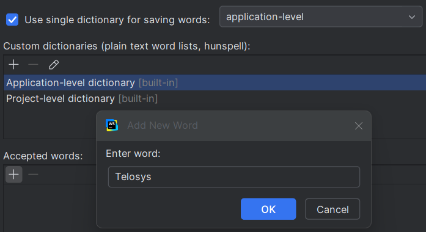

# Telosys with JetBrains IDE

For seamless integration of **Telosys** with a **JetBrains IDE** (IntelliJ, PyCharm, GoLand, PhpStorm, etc.), the simplest approach is to launch the telosys command in the IDE's integrated **terminal** and install the **plugin** that provides syntax highlighting for .entity files.

<figure><figcaption></figcaption></figure>

### 1 – Launching Telosys in the Terminal

**Prerequisite**: \
The **`telosys`** command must be accessible via the **`PATH`** (an environment variable of the shell you are using; see "Telosys installation" for details).

**Steps**:

* Open a new tab in the IDE's terminal with the shell of your choice (by default, the current directory is the root of the active project).&#x20;
* Launch Telosys from this shell: \
  Command: **`telosys`** (or **`tt`** for older versions). \
  Telosys starts in the current directory.
* Set the Telosys "home" directory with the command  **`h .`**&#x20;

**Note**: \
You can also launch Telosys with the -h . parameter so that the "home" directory is set immediately.\
Command:   **`telosys -h .`**&#x20;

<figure><figcaption></figcaption></figure>

### 2 - Terminal customization

You can also use the IDE settings to define Telosys as the terminal shell.

**Steps**:

* Open the "**Settings**" (Ctrl + Alt + S)
* Go to  "**Tools / Terminal**"
* Define Telosys as the default shell :&#x20;
  * Shell path:  **`aaa/bbb/ccc/telosys.bat -h .`**\
    (telosys command full path, with ".bat" extension on Windows)
  * Default tab name: **`Telosys`**

Example:

<figure><figcaption></figcaption></figure>

By doing so, Telosys will be launched by default every time a new tab is opened in the terminal ( for example by clicking on “**`+`**” or with "**`Ctrl+Shift+T`**" )

### 3 - Plugin installation

See: [https://telosys.hashnode.dev/telosys-plugin-for-jetbrains-ide](https://telosys.hashnode.dev/telosys-plugin-for-jetbrains-ide)&#x20;

### 4 - Tips and tricks for IDE

#### Spelling&#x20;

If you have the word "Telosys" in the generated code (in comments for examples) \
the IDE will consider it as a "typo". \
To avoid that you just have to add it in the IDE dictionary:

* In the menu:  **Settings** / **Preferences** : search "_spelling_"
*   Select the dictionary:

    * Application-level = for all projects you open in this IDE
    * Project-level =  only the current project
    * ⇒ Select **application-level**
    * Add the new word \[+]  in "**Accepted words**"

    <figure><figcaption></figcaption></figure>

